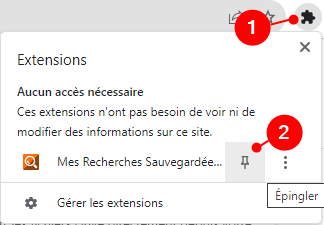
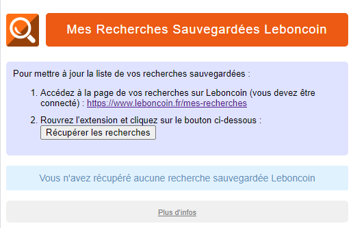

# Qu'est-ce que l'extension "Mes Recherches Sauvegardées Leboncoin" ?

**Mes Recherches Sauvegardées Leboncoin** est une extension pour navigateur Google Chrome, Microsoft Edge, Vivaldi, qui permet d'accéder facilement à ses différentes recherches sauvegardées Leboncoin.

Sur le site Leboncoin.fr, si vous disposez d'un compte, vous pouvez créer des recherches personnalisées et les sauvegarder pour y revenir facilement. Grâce à l'extension **Mes Recherches Sauvegardées Leboncoin**, plus besoin de vous rendre sur LBC, elle vous permet d'accéder en un clic à la liste de vos recherches sauvegardées !

# Installation

L'extension **Mes Recherches Sauvegardées Leboncoin** est disponible sur les différents *stores* des navigateurs suivants : 

* Google Chrome
* Microsoft Edge
* Vivaldi

# Utilisation

Après avoir installé l'extension, affichez-la dans votre barre :

Pour que l'extension affiche la liste de vos recherches sauvegardées, vous devez vous rendre sur le site Leboncoin.fr, vous y connecter et accéder à la [page de vos recherches](https://www.leboncoin.fr/mes-recherches).

Une fois sur cette page, ouvrez l'extension et cliquez sur le bouton "Récupérer les recherches" :

La liste de vos recherches sont récupérées depuis la page Leboncoin et sont désormais accessibles depuis l'extension !

Bien sûr, lorsque vous mettez à jour ou lorsque vous créez de nouvelles recherches sur Leboncoin, pensez à mettre à jour la liste des recherches sur l'extension toujours en cliquant sur le bouton "Récupérer les recherches" ;)

# Feedback

Si vous rencontrez un problème avec l'extension, ou que vous souhaitez une évolution, n'hésitez pas à créer une *issue* ou à me contacter sur [Twitter/X](https://twitter.com/shevabam) !

# Politique de confidentialité

L'extension ne collecte aucune information sur l'utilisateur ou d'autres informations.

L'extension stocke dans le navigateur uniquement la liste de vos recherches sauvegardées Leboncoin ainsi que la dernière date de mise à jour de cette liste.